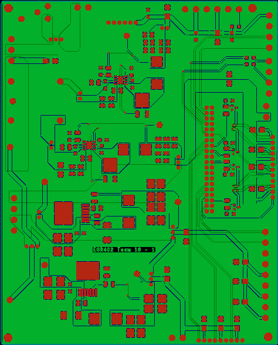
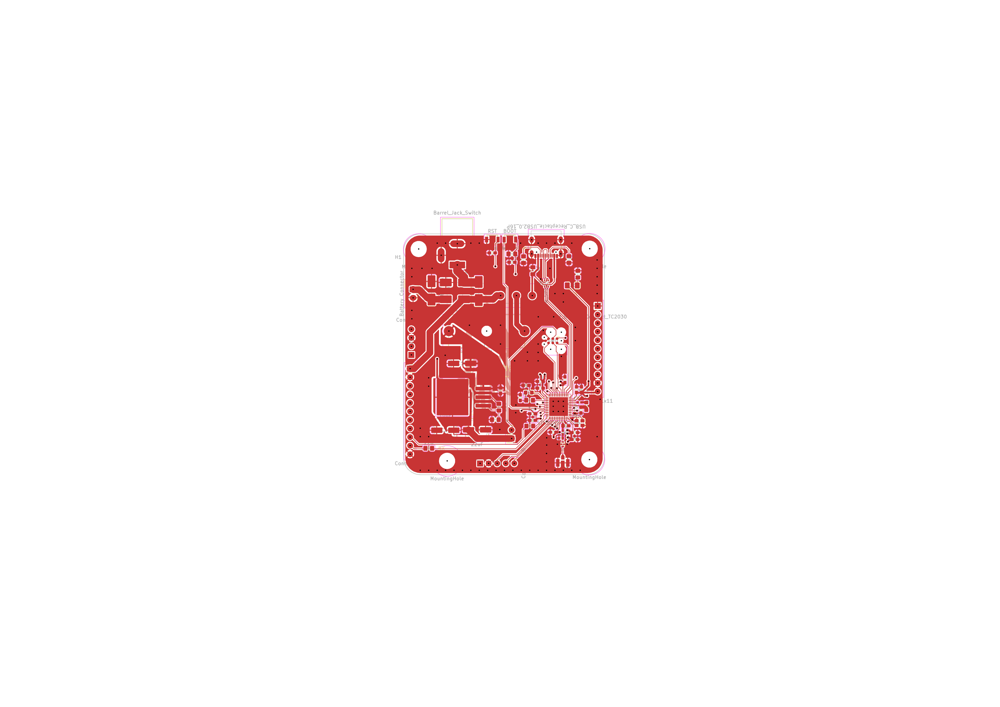
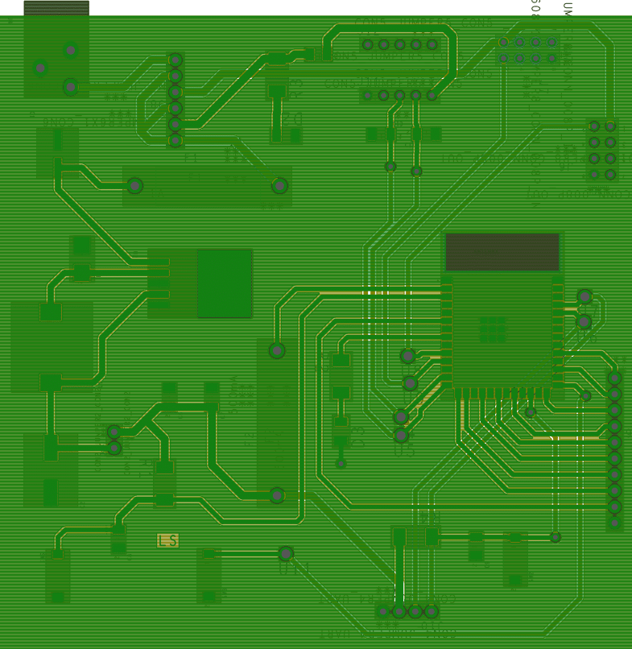

# Projects

Engineering solutions from concept to deployment.  
Below are two featured projects — each links to a full case study.

---

## Featured Projects

| Thumbnail | Project | Summary | Tech |
| ---: | --- | --- | --- |
|  | **Ceiling‑Mounted Drone Docking System** — [Case Study](cmdep.md) | Axon needed a reliable ceiling‑mounted drone docking system → so I designed a custom embedded controller and actuator interface, enabling repeatable autonomous docking and release during testing. | Arduino · Raspberry Pi5 · Embedded-Systems · PCB Design |
|  | **STM32 - Dev Board** — [Case Study](stmdevb.md) | NEEDS INFO | KiCad · ESD protection · RF · STM32 · JLCPCB DFM |
|  | **STEM - DAM** — [Case Study](esproj.md) | Created a project integrating four subsystems to teach students core S.T.E.M. concepts. → Conceptually designed a mock dam to demonstrate generators, electricity, and clean‑energy principles. → Delivered an IoT PCB featuring a step‑down buck regulator that supplied stable power and enabled users to view real‑time system data. | Python · ESP32 · MQTT · IoT |
